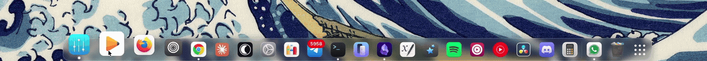

# Dash2Dock Motion

A dock for GNOME Shell with pointer-tracking icon magnification and a
translucent glass slab. It is a modified copy of
[Dash to Dock](https://github.com/micheleg/dash-to-dock), which supplies the
dock itself, extended with a magnification engine that scales icons under the
cursor and reflows their neighbours around them.



## Features

- Icon magnification driven directly by the pointer, with a configurable peak
  scale and influence width.
- Icons, running indicators and notification badges are rendered oversampled
  and scaled down, so they stay sharp at any magnification.
- A configurable gap between the dock and the screen edge, which can also be
  negative to push the dock past the edge.
- A translucent slab with an optional rim border. The backdrop blur is left to
  [Blur my Shell](https://github.com/aunetx/blur-my-shell) rather than
  reimplemented here.
- Everything Dash to Dock already provides: autohide, intellihide, multi
  monitor support, window previews, running indicators and app spread.

## Requirements

GNOME Shell 50, on Wayland or X11.

Blur my Shell is optional. If you want the dock blurred, install it and enable
its dash blur.

## Installation

### From source

```sh
git clone https://github.com/Unmade760/dash2dock-motion.git
cd dash2dock-motion
make install
```

GNOME Shell 50 has no extension hot-reload, so log out and back in, then:

```sh
gnome-extensions enable dash2dock-motion@unmade.space
```

`make zip` builds a package suitable for uploading, and `make uninstall`
removes the installed copy.

Run only one dock at a time. Disable Dash to Dock, any other dock extension and
the built-in `dock@gnome-shell-extensions.gcampax.github.com` before enabling
this one, or they will fight over the dash.

## Configuration

```sh
gnome-extensions prefs dash2dock-motion@unmade.space
```

The Dash2Dock Motion page holds the settings below. The remaining pages are
Dash to Dock's own.

| Key | Range | Default | Effect |
| --- | --- | --- | --- |
| `magnify-max-scale` | 1.0 to 3.0 | 1.45 | Scale of the icon under the cursor. 1.0 disables magnification |
| `magnify-effect-width` | 160 to 560 px | 445 | Width of the influence zone along the dock |
| `magnify-rise` | 0.0 to 1.0 | 0.0 | How far magnified icons lift off the slab |
| `edge-distance` | -16 to 8 px | -5 | Gap from the screen edge. Negative pushes the dock past it |
| `glass-outline` | boolean | true | Rim border around the slab |
| `show-icon-highlight` | boolean | false | Translucent box behind hovered and focused icons |

## How the magnification works

A raised-cosine (Hann) window maps cursor position to icon scale, which gives
zero slope at both edges of the influence zone and at the peak, so icons do not
snap as the pointer crosses a boundary. Icons are anchored on the dock's screen
edge and grow outwards past the slab.

Positions come from a cumulative layout walk. Each slot is widened by its own
magnification and the results are accumulated, anchored so that the point under
the cursor stays under the cursor. Neighbouring icons flow outwards as a
consequence rather than being positioned individually.

Lateral response is instantaneous, because scale is a direct function of
pointer position on every frame. The only animated quantity is a scalar
envelope, integrated as a critically damped spring when the pointer enters or
leaves the dock. Nothing is re-laid-out per frame: only `pivot_point`,
`set_scale` and `translation_x/y` are touched.

## Bug reporting

Please open an issue at
https://github.com/Unmade760/dash2dock-motion/issues.

Bugs in the dock itself, meaning autohide, intellihide, struts, theming or the
preferences pages other than Dash2Dock Motion, most likely belong upstream at
[micheleg/dash-to-dock](https://github.com/micheleg/dash-to-dock/issues).
Please check there first, and mention that you are running this fork if you
report here.

## Relationship to upstream

This is a modified copy of Dash to Dock v105, not a fork intended to replace
it. The schema id and UUID are renamed so the two can be installed side by
side.

`magnifier.js` and `glass.js` are original to this program and hold the
magnification engine and the slab's style layer. The modified upstream files
are:

- `appIcons.js`: oversampled icon textures, the `animateLaunch()` bounce, and
  an `updateIconGeometry()` that derives the minimize target from the
  allocation chain so per-frame transforms cannot displace it.
- `appIconIndicators.js`: oversampled running dots and notification badge.
- `dash.js`: `refreshIconResolution()`.
- `docking.js`: magnifier and glass wiring, the edge distance setting, and a
  padded slide-container clip so magnified icons are not cut off.
- `prefs.js`: the Dash2Dock Motion preferences page.
- `utils.js`: `getIconOversample()`.
- `stylesheet.css`, `schemas/*.gschema.xml`, `metadata.json`, `imports.js` and
  `extension.js`: the corresponding additions.

Every other file is upstream v105 verbatim.

## Credits

- [Dash to Dock](https://github.com/micheleg/dash-to-dock) by Michele Gaio
  (micheleg) and contributors. The dock core, covering docking, autohide,
  intellihide, struts, theming, app icons and preferences, is v105.
- [Dash2Dock Animated](https://github.com/icedman/dash2dock-lite) by icedman,
  studied while working out the launch bounce and the per-frame animation
  approach. No code from it is included.

Not affiliated with or endorsed by either project.

## License

GPL-2.0-or-later, matching upstream, which is distributed under the terms of
the GNU General Public License, version 2 or later. The full licence text is
in [COPYING](COPYING), and the attribution required when redistributing is in
[NOTICE](NOTICE).
